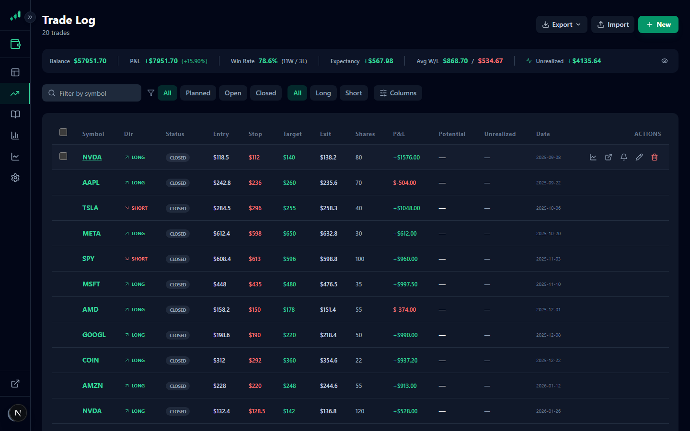

<div align="center">

# 📈 Ledger Of Alpha

**A self-hosted trading journal, planner, and chart dashboard built for serious traders.**

[](https://nextjs.org/)
[](https://www.typescriptlang.org/)
[](https://tailwindcss.com/)
[](https://github.com/WiseLibs/better-sqlite3)
[](LICENSE)

*Log trades · Plan setups · Analyze performance · Send chart snapshots to Discord*

</div>

---

## 📸 Screenshots

### Dashboard

*Total P&L, win rate, avg win/loss, expectancy stats. Unrealized P&L for open positions. Interactive equity curve and recent trades table.*

### Trade Log

*20 trades with full P&L coloring, status filters, symbol search, column picker. Export/import as CSV or JSON.*

### Trade Log — Symbol Hover

*Hover any symbol to see a live mini candlestick chart with entry, stop, and target levels overlaid.*

### Trade Journal

*Card-based review with notes, tags, expandable mini charts, potential P&L, and R:R ratio per trade.*

### Chart — TradingView + Watchlist + Add Trade

*Full-screen TradingView chart with multi-tab support, resizable watchlist sidebar with sector grouping, and collapsible Add Trade panel with risk calculator.*

### Settings

*Account size, risk %, commission per trade, FMP API key, Discord webhook, and data management (export/import).*

### Login

*Clean auth page with guest mode, 2FA support, and email verification.*

---

### 📱 Mobile — Fully Responsive

<table>
  <tr>
    <td align="center"><b>Dashboard</b><br/></td>
    <td align="center"><b>Trade Log</b><br/></td>
    <td align="center"><b>Chart + Add Trade</b><br/></td>
    <td align="center"><b>Settings</b><br/></td>
  </tr>
</table>

*Stats stack to single column · Trade log renders as cards · Chart fills the screen with a floating "Add Trade" button · All forms stack vertically*

---

## ✨ Features

### 📊 Dashboard
- At-a-glance stats: total P&L, win rate, avg win/loss, expectancy, open/planned count
- Interactive cumulative P&L equity curve (Recharts)
- Paginated recent-trades table with inline edit/delete
- Add-trade modal directly from the dashboard

### 📋 Trade Log
- Full trade history with live filters: symbol search, status (planned / open / closed), direction (long / short)
- P&L coloring, live unrealized P&L for open positions (refreshes every 60s via Yahoo Finance)
- Edit and delete any trade without leaving the page
- Hover any symbol to preview a mini candlestick chart with trade levels
- **Export** trades as CSV or JSON for backup and analysis
- **Import** trades from CSV or JSON files with validation and error reporting
- Mobile: card-per-trade layout; Desktop: full sortable table

### 📓 Trade Journal
- Card-based view of every trade with full notes, tags, symbol, and P&L
- Filter between "all trades" and "trades with notes"
- Expandable mini candlestick chart per card with entry/stop/target price lines
- Potential P&L and R:R ratio displayed per card
- Global chart toggle to show/hide all mini charts at once
- Always-visible "Select All" checkbox with inline bulk delete
- Clean reading layout for post-trade review

### 📈 Chart Page
- Full-screen **TradingView Advanced Chart** embed (dark/light theme sync)
- Multi-tab support — open multiple charts, rename tabs, persist across sessions
- Interval switcher: 1m · 5m · 15m · 1h · 4h · 1D · 1W
- **Watchlist sidebar** — resizable, with sector grouping, drag-to-reorder, filter, import/export, and collapsible sections
- **Add Trade panel** — collapsible sidebar with:
  - Interactive mini-chart (click to set entry / stop / target, drag to reposition)
  - Live RiskCalculator and PositionSizer as you type
  - Per-trade account size, risk %, and commission fields
  - Save as Planned or **Save + Share to Discord** in one click
- **Discord snapshot** — screen capture with 3-second countdown, or paste a TradingView snapshot link

### ⚙️ Settings
- Account size, risk-per-trade percentage, and commission per trade
- Financial Modeling Prep (FMP) API key + on-demand symbol list refresh
- Discord webhook URL for chart snapshot delivery
- **Data Management** — export/import trades directly from settings

### 🔐 Auth & Security
- JWT sessions with email/password login
- **2FA** — TOTP (authenticator app) with backup codes
- Email verification on signup
- **Guest mode** — explore the app with realistic demo data, no account required
- **Admin panel** — manage users, toggle admin rights, configure SMTP
- **Rate limiting** — per-IP throttling on auth and API endpoints
- **Security headers** — CSP, HSTS, X-Frame-Options via middleware
- **Input validation** — server-side trade data sanitization and type checking
- **Error sanitization** — internal details never leaked to clients

---

## 🛠 Tech Stack

| Layer | Technology |
|---|---|
| Framework | Next.js 15 (App Router) |
| Language | TypeScript |
| Styling | Tailwind CSS v3 + dark/light theme via `next-themes` |
| Database | SQLite via `better-sqlite3` |
| Charts | Recharts (P&L curve) · TradingView Advanced Chart · lightweight-charts (setup mini-chart) |
| Icons | Lucide React |
| External APIs | Yahoo Finance (live quotes + OHLCV) · Financial Modeling Prep (symbol search) · Discord Webhooks |

---

## 🚀 Getting Started

```bash
git clone https://github.com/david1x/ledger-of-alpha.git
cd ledger-of-alpha
npm install
npm run dev
```

Open [http://localhost:3000](http://localhost:3000). The SQLite database is created automatically — no setup required.

> **Try it instantly** — click **Continue as Guest** on the login page to explore with pre-loaded demo trades. No account needed.

### Docker

```bash
cp docker-compose.example.yml docker-compose.yml
# Edit docker-compose.yml — set JWT_SECRET and SMTP credentials
docker compose up -d --build
```

The SQLite database is persisted in `./data/`.

For detailed setup instructions (environment variables, SMTP configuration, admin setup, troubleshooting), see **[GETTING-STARTED.md](GETTING-STARTED.md)**.

---

## 📁 Project Structure

```
ledger-of-alpha/
├── app/
│   ├── page.tsx              # Dashboard
│   ├── trades/page.tsx       # Full trade log
│   ├── journal/page.tsx      # Journal card view
│   ├── chart/page.tsx        # TradingView chart + Add Trade panel
│   ├── settings/page.tsx     # App settings
│   ├── admin/                # Admin panel (users + SMTP)
│   ├── layout.tsx            # Root layout (Navbar, ThemeProvider)
│   └── api/
│       ├── trades/           # GET + POST trades
│       ├── trades/[id]/      # GET + PUT + DELETE single trade
│       ├── trades/import/    # POST bulk import
│       ├── settings/         # GET + PUT settings
│       ├── symbols/          # GET symbols (FMP cache)
│       ├── quotes/           # Live prices (Yahoo Finance)
│       ├── ohlcv/            # OHLCV bars for setup chart
│       ├── discord/          # POST chart snapshot to webhook
│       └── auth/             # Login, register, 2FA, guest
├── components/
│   ├── Navbar.tsx
│   ├── Logo.tsx
│   ├── PersistentChart.tsx   # Chart page shell (tabs, toolbar, panel)
│   ├── SetupChart.tsx        # Interactive mini-chart (click/drag price levels)
│   ├── MiniChart.tsx         # Read-only mini chart (journal cards, hover popover)
│   ├── TradeTable.tsx        # Trade log table + mobile card view
│   ├── TradeModal.tsx        # Edit/view trade modal
│   ├── RiskCalculator.tsx    # Live risk metrics
│   ├── PositionSizer.tsx     # Optimal share count calculator
│   └── SymbolSearch.tsx      # Debounced symbol autocomplete
├── lib/
│   ├── db.ts                 # SQLite init + schema migrations
│   ├── auth.ts               # JWT, bcrypt, admin guard
│   ├── rate-limit.ts         # Per-IP rate limiting
│   ├── validate-trade.ts     # Server-side trade input validation
│   ├── csv.ts                # CSV export/import utilities
│   └── demo-data.ts          # Realistic fake trades for guest mode
└── data/
    └── ledger-of-alpha.db    # Auto-created, gitignored
```

---

## 🗄 Database Schema

```sql
CREATE TABLE trades (
  id             INTEGER PRIMARY KEY AUTOINCREMENT,
  user_id        TEXT,              -- FK to users.id (enforced at app layer)
  symbol         TEXT NOT NULL,
  direction      TEXT NOT NULL,     -- 'long' | 'short'
  status         TEXT NOT NULL,     -- 'planned' | 'open' | 'closed'
  entry_price    REAL,
  stop_loss      REAL,
  take_profit    REAL,
  exit_price     REAL,
  shares         REAL,
  entry_date     TEXT,
  exit_date      TEXT,
  pnl            REAL,
  notes          TEXT,
  tags           TEXT,
  account_size   REAL,             -- snapshot at time of trade
  commission     REAL,
  risk_per_trade REAL,
  created_at     TEXT DEFAULT (datetime('now'))
);

CREATE TABLE settings (
  user_id TEXT NOT NULL,            -- '_system' for global settings
  key     TEXT NOT NULL,
  value   TEXT NOT NULL DEFAULT '',
  PRIMARY KEY (user_id, key)
);

CREATE TABLE users (
  id                     TEXT PRIMARY KEY,
  email                  TEXT UNIQUE NOT NULL,
  name                   TEXT NOT NULL,
  password_hash          TEXT NOT NULL,
  email_verified         INTEGER NOT NULL DEFAULT 0,
  two_factor_secret      TEXT,
  two_factor_enabled     INTEGER NOT NULL DEFAULT 0,
  two_factor_backup_codes TEXT,
  is_admin               INTEGER NOT NULL DEFAULT 0,
  created_at             TEXT DEFAULT (datetime('now'))
);
```

---

## 📸 Discord Snapshot Flow

1. Open the **Chart** page and load any symbol/timeframe
2. Optionally type a note in the toolbar
3. Click **Capture → Discord**
4. Browser prompts for screen-share permission — click **Share this tab**
5. A **3-second countdown** appears — move your mouse off the chart
6. The chart is automatically cropped and posted to your Discord channel

Alternatively, publish a TradingView snapshot (camera icon → **Publish**), paste the link into the toolbar, and click **Send Link → Discord** — no screen capture required.

---

## 🌙 Dark / Light Mode

Defaults to dark mode. Toggle with the sun/moon button in the navbar. The TradingView chart syncs its theme automatically.

---

## 📄 License

MIT — use it, fork it, trade with it.
