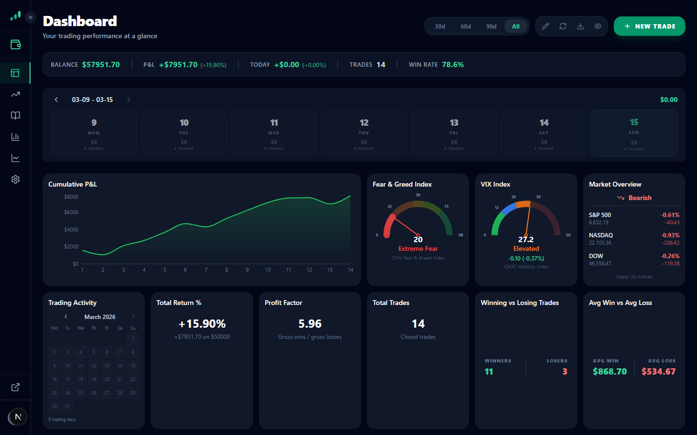
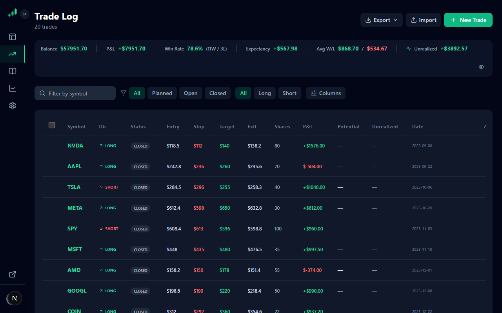
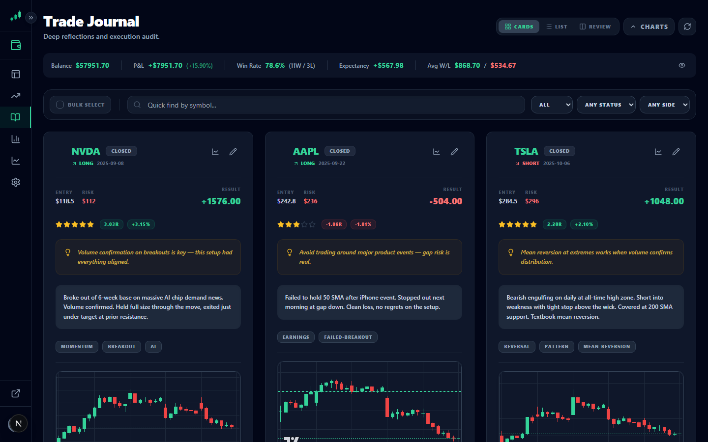
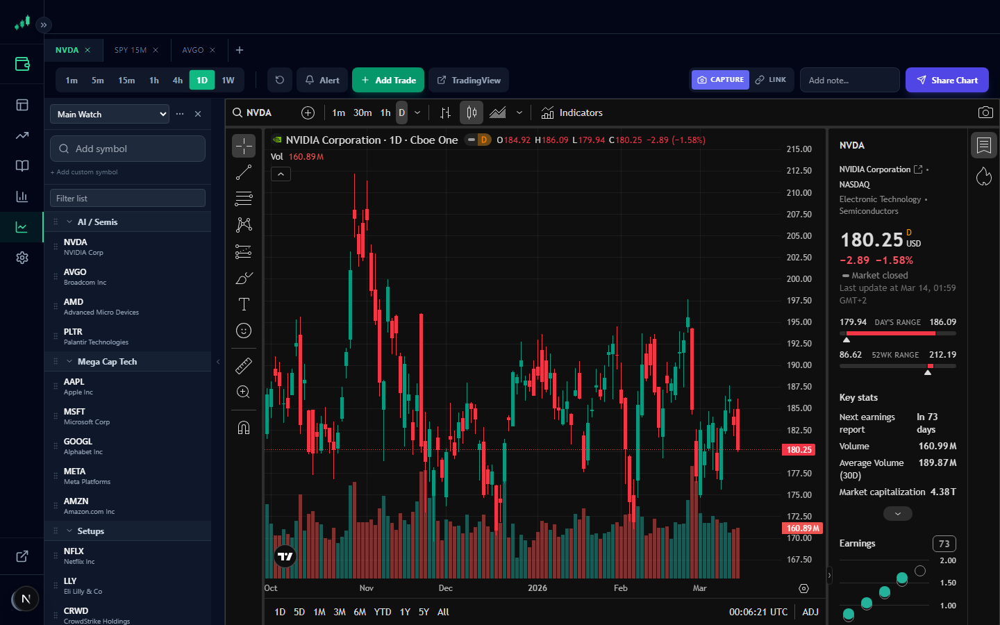
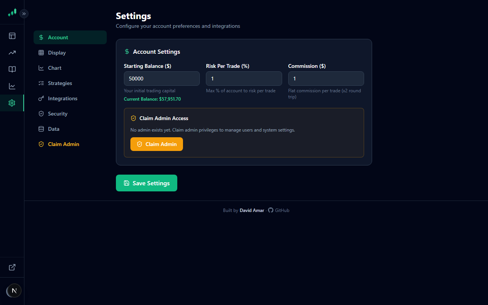
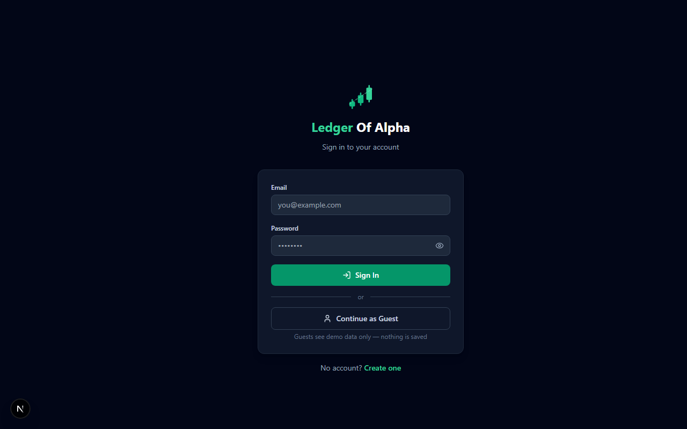
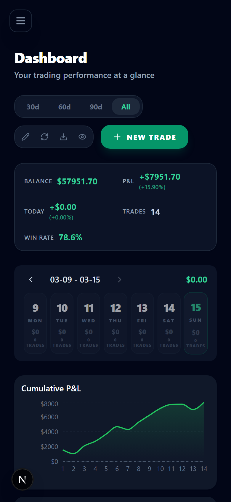
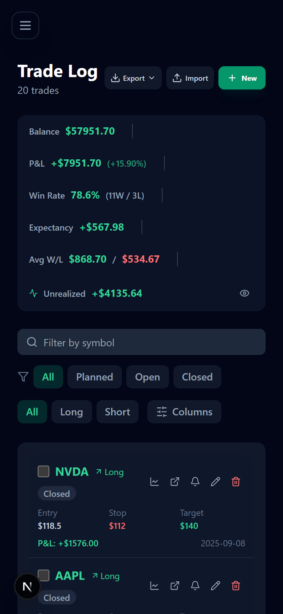
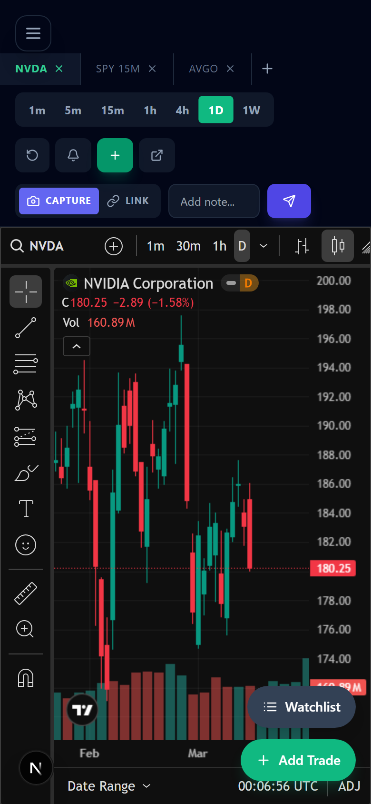
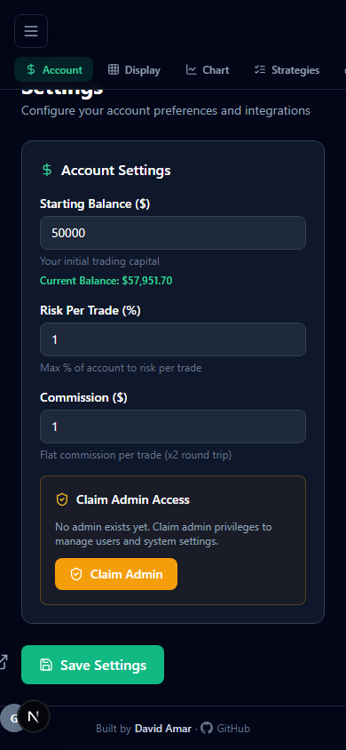

<div align="center">

# 📈 Ledger Of Alpha

**A self-hosted trading journal, planner, and chart dashboard built for serious traders.**

[](https://nextjs.org/)
[](https://www.typescriptlang.org/)
[](https://tailwindcss.com/)
[](https://github.com/WiseLibs/better-sqlite3)
[](LICENSE)

*Log trades · Plan setups · Analyze performance · Send chart snapshots to Discord*

</div>

---

## 📸 Screenshots

### Dashboard

*Stats cards, cumulative P&L equity curve, and recent trades — all with live demo data on first load.*

### Trade Log

*Filter by symbol, status (planned / open / closed), or direction. Full P&L coloring throughout.*

### Trade Journal

*Card-based view with trade notes, tags, entry/stop/target, and P&L at a glance.*

### Chart — TradingView + Add Trade Panel

*Full-screen TradingView Advanced Chart with a collapsible Add Trade sidebar. Plan your setup, capture it, and post to Discord in one click.*

### Settings

*Configure account size, risk %, FMP API key, and Discord webhook.*

### Login

*Clean auth page with guest mode, 2FA support, and email verification.*

---

### 📱 Mobile — Fully Responsive

<table>
  <tr>
    <td align="center"><b>Dashboard</b><br/></td>
    <td align="center"><b>Trade Log</b><br/></td>
    <td align="center"><b>Chart + Add Trade</b><br/></td>
    <td align="center"><b>Settings</b><br/></td>
  </tr>
</table>

*Stats stack to single column · Trade log renders as cards · Chart fills the screen with a floating "Add Trade" button · All forms stack vertically*

---

## ✨ Features

### 📊 Dashboard
- At-a-glance stats: total P&L, win rate, avg win/loss, expectancy, open/planned count
- Interactive cumulative P&L equity curve (Recharts)
- Paginated recent-trades table with inline edit/delete
- Add-trade modal directly from the dashboard

### 📋 Trade Log
- Full trade history with live filters: symbol search, status (planned / open / closed), direction (long / short)
- P&L coloring, live unrealized P&L for open positions (refreshes every 60s via Yahoo Finance)
- Edit and delete any trade without leaving the page
- Mobile: card-per-trade layout; Desktop: full sortable table

### 📓 Trade Journal
- Card-based view of every trade with full notes, tags, symbol, and P&L
- Filter between "all trades" and "trades with notes"
- Clean reading layout for post-trade review

### 📈 Chart Page
- Full-screen **TradingView Advanced Chart** embed (dark/light theme sync)
- Multi-tab support — open multiple charts, rename tabs, persist across sessions
- Interval switcher: 1m · 5m · 15m · 1h · 4h · 1D · 1W
- **Add Trade panel** — collapsible sidebar with:
  - Interactive mini-chart (click to set entry / stop / target, drag to reposition)
  - Live RiskCalculator and PositionSizer as you type
  - Save as Planned or **Save + Share to Discord** in one click
- **Discord snapshot** — screen capture with 3-second countdown, or paste a TradingView snapshot link

### ⚙️ Settings
- Account size and risk-per-trade percentage
- Financial Modeling Prep (FMP) API key + on-demand symbol list refresh
- Discord webhook URL for chart snapshot delivery

### 🔐 Auth & Security
- JWT sessions with email/password login
- **2FA** — TOTP (authenticator app) with backup codes
- Email verification on signup
- **Guest mode** — explore the app with realistic demo data, no account required
- **Admin panel** — manage users, toggle admin rights, configure SMTP

---

## 🛠 Tech Stack

| Layer | Technology |
|---|---|
| Framework | Next.js 15 (App Router) |
| Language | TypeScript |
| Styling | Tailwind CSS v3 + dark/light theme via `next-themes` |
| Database | SQLite via `better-sqlite3` |
| Charts | Recharts (P&L curve) · TradingView Advanced Chart · lightweight-charts (setup mini-chart) |
| Icons | Lucide React |
| External APIs | Yahoo Finance (live quotes + OHLCV) · Financial Modeling Prep (symbol search) · Discord Webhooks |

---

## 🚀 Getting Started

### Prerequisites
- Node.js 18+
- npm

### Installation

```bash
git clone https://github.com/your-username/ledger-of-alpha.git
cd ledger-of-alpha/tradeviz
npm install
npm run dev
```

Open [http://localhost:3000](http://localhost:3000).

The SQLite database is created automatically at `data/ledger-of-alpha.db` on the first API call — no setup required.

> **Try it instantly** — click **Continue as Guest** on the login page to explore with pre-loaded demo trades. No account needed.

### Configuration

All configuration is done inside the app at **Settings → ⚙️**.

| Setting | Required | Description |
|---|---|---|
| Account Size | Yes | Your trading account balance in USD |
| Risk Per Trade | Yes | Percentage of account risked per trade (default 1%) |
| FMP API Key | Optional | Enables live symbol search. Get a free key at [financialmodelingprep.com](https://financialmodelingprep.com) |
| Discord Webhook | Optional | Paste a webhook URL to enable chart-to-Discord snapshots |

---

## 📁 Project Structure

```
tradeviz/
├── app/
│   ├── page.tsx              # Dashboard
│   ├── trades/page.tsx       # Full trade log
│   ├── journal/page.tsx      # Journal card view
│   ├── chart/page.tsx        # TradingView chart + Add Trade panel
│   ├── settings/page.tsx     # App settings
│   ├── admin/                # Admin panel (users + SMTP)
│   ├── layout.tsx            # Root layout (Navbar, ThemeProvider)
│   └── api/
│       ├── trades/           # GET + POST trades
│       ├── trades/[id]/      # GET + PUT + DELETE single trade
│       ├── settings/         # GET + PUT settings
│       ├── symbols/          # GET symbols (FMP cache)
│       ├── quotes/           # Live prices (Yahoo Finance)
│       ├── ohlcv/            # OHLCV bars for setup chart
│       ├── discord/          # POST chart snapshot to webhook
│       └── auth/             # Login, register, 2FA, guest
├── components/
│   ├── Navbar.tsx
│   ├── Logo.tsx
│   ├── PersistentChart.tsx   # Chart page shell (tabs, toolbar, panel)
│   ├── SetupChart.tsx        # Interactive mini-chart (click/drag price levels)
│   ├── TradeTable.tsx        # Trade log table + mobile card view
│   ├── TradeModal.tsx        # Edit/view trade modal
│   ├── RiskCalculator.tsx    # Live risk metrics
│   ├── PositionSizer.tsx     # Optimal share count calculator
│   └── SymbolSearch.tsx      # Debounced symbol autocomplete
├── lib/
│   ├── db.ts                 # SQLite init + schema migrations
│   ├── auth.ts               # JWT, bcrypt, admin guard
│   └── demo-data.ts          # Realistic fake trades for guest mode
└── data/
    └── ledger-of-alpha.db    # Auto-created, gitignored
```

---

## 🗄 Database Schema

```sql
CREATE TABLE trades (
  id          INTEGER PRIMARY KEY AUTOINCREMENT,
  symbol      TEXT NOT NULL,
  direction   TEXT NOT NULL,   -- 'long' | 'short'
  status      TEXT NOT NULL,   -- 'planned' | 'open' | 'closed'
  entry_price REAL,
  stop_loss   REAL,
  take_profit REAL,
  exit_price  REAL,
  shares      REAL,
  entry_date  TEXT,
  exit_date   TEXT,
  pnl         REAL,
  notes       TEXT,
  tags        TEXT,
  created_at  TEXT DEFAULT (datetime('now'))
);

CREATE TABLE settings (
  key   TEXT PRIMARY KEY,
  value TEXT
);
```

---

## 📸 Discord Snapshot Flow

1. Open the **Chart** page and load any symbol/timeframe
2. Optionally type a note in the toolbar
3. Click **Capture → Discord**
4. Browser prompts for screen-share permission — click **Share this tab**
5. A **3-second countdown** appears — move your mouse off the chart
6. The chart is automatically cropped and posted to your Discord channel

Alternatively, publish a TradingView snapshot (camera icon → **Publish**), paste the link into the toolbar, and click **Send Link → Discord** — no screen capture required.

---

## 🌙 Dark / Light Mode

Defaults to dark mode. Toggle with the sun/moon button in the navbar. The TradingView chart syncs its theme automatically.

---

## 📄 License

MIT — use it, fork it, trade with it.
